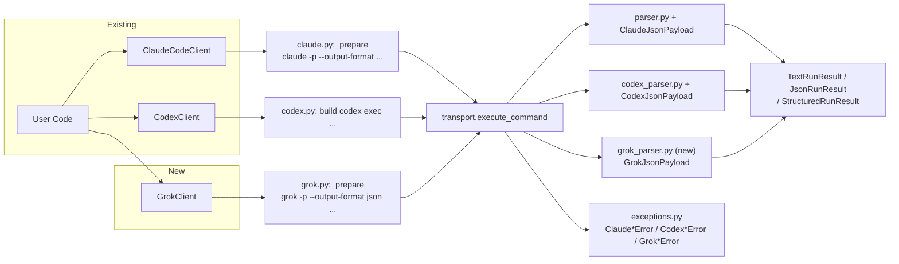

# Add Grok CLI Backend Support

## Motivation

Add first-class support for the local `grok` CLI (Grok Build TUI) as a third backend in `stan_ai_client`, alongside the existing `ClaudeCodeClient` and `CodexClient`.

### Current Situation

`stan_ai_client` is a thin synchronous Python wrapper around local AI coding CLIs. It provides:

- `ClaudeCodeClient` that shells out to `claude -p --output-format ...` (with `--json-schema` for structured).
- `CodexClient` that shells out to `codex exec` (with `--json` and `--output-schema`).
- Unified `run_text()`, `run_json()`, `run_structured()` APIs.
- `RunOptions` / `CodexRunOptions`, typed payloads, local schema validation, normalized exceptions, and opt-in `RateLimitRetryPolicy`.
- Prompt via stdin (default) or argv; full session resume/continue support for Claude.

The library deliberately avoids direct API calls and keeps auth, configuration, and tool behavior inside the installed CLI.

### Why

- The `grok` CLI exposes a documented headless mode (`-p` / `--single`) with `--output-format json` and `--json-schema` that is suitable for the same automation patterns already supported for Claude and Codex.
- Users (and existing automation built on `stan_ai_client`) want a consistent Python surface for text, JSON, and schema-guided structured output plus session management when they have `grok` installed instead of (or in addition to) `claude` or `codex`.
- Adding it follows the precedent of the Codex addition (RFC_CODEX_SUPPORT.md) without changing the core "wrap local CLI" philosophy.

## Proposal

Introduce a `GrokClient` that drives `grok -p` for non-interactive use, mirroring the shape and ergonomics of the existing clients as closely as practical.

The primary delivery mechanism is the `-p` / `--single` headless mode (explicitly documented for scripting, CI, and automation). We will not use the more complex `grok agent stdio` / ACP protocol in this iteration.

### In-Scope Goals

- `GrokClient` with `run_text()`, `run_json()`, and `run_structured()`.
- Support for key `-p` flags: `--output-format` (plain/json), `--json-schema`, `--model`, `--effort` / `--reasoning-effort`, `--permission-mode`, `--tools` / `--disallowed-tools`, system prompt overrides, `--cwd`, session controls (`-c`/`--continue`, `-r`/`--resume`, `-s`/`--session-id`, `--fork-session`), `--max-turns`, etc.
- Session continuity across separate `grok -p` invocations (proven to preserve conversation history).
- Reuse of `RateLimitRetryPolicy` (rate limits are observable via stderr/stdout text).
- Local JSON Schema validation for structured mode (same as today).
- Typed results, command metadata, and normalized exceptions (`Grok*Error` family).
- New `GrokRunOptions` (modeled after `CodexRunOptions`) and a `GrokJsonPayload`. `GrokRunOptions` will not expose an `input_mode` (prompt delivery is handled transparently by the client). The client will also surface a measured `duration_ms` on the payload.
- Documentation, smoke-test example, and tests parallel to existing clients.
- `extra_args` escape hatch for any unsupported flags.

### Out-of-Scope Non-Goals

- Implementing or wrapping `grok agent stdio`, `headless`, or the full Agent Client Protocol (ACP).
- Streaming support (`streaming-json` or live events).
- Async API.
- Direct calls to xAI/Grok public APIs (bypassing the local CLI).
- Exposing or synthesizing token usage / cost metrics (not provided in the `-p` JSON envelope).
- Cross-provider unified abstract base class (keep separate clients like today).
- Worktree management, subagents, plugins, or MCP configuration from this library.
- Changes to how Grok itself discovers or uses CLAUDE.md / skills (it already does this).

### Headless `-p` Mode as the Integration Point

`grok -p "prompt" --output-format json` (and with `--json-schema`) is the intended surface. It prints a single JSON object (or plain text) and exits. This matches the one-shot subprocess model used by the rest of the library.

`grok agent ...` subcommands exist for richer integrations but are out of scope here.

### Session Support

Grok provides strong session semantics for `-p`:

- `-c` / `--continue`
- `-r` / `--resume <ID>`
- `-s` / `--session-id <ID>` (headless-friendly: creates if absent)
- `--fork-session`

Every JSON response includes `sessionId`. Experiments confirmed that resuming a session with a follow-up `-p` call correctly carries conversation context.

This is equal to or better than Claude for named automation use cases.

### Prompt Delivery

Grok's `-p` / `--single` requires the prompt to be supplied as the value to the flag (or via `--prompt-file`). Unlike Claude, there is no convenient stdin mode for the prompt when using `-p`.

The `GrokClient` will handle prompt delivery **transparently** with no user-facing `input_mode` choice required:

- Short and medium prompts are passed directly via the `-p` argument (Python's `subprocess` list form avoids shell quoting issues).
- For very long prompts (to stay well under argv length limits), the client will automatically write the prompt to a temporary file and use `--prompt-file`.
- The temporary file (if used) is cleaned up after the invocation.

Users simply pass the prompt string; the library chooses the safest mechanism.

### What Cannot Be Matched 1:1

These differences are fundamental to the CLI contract and must be accepted (or worked around) in the implementation and documentation. They are called out explicitly so there are no surprises:

- **Prompt input**: No stdin equivalent for `-p`. The library handles delivery transparently (direct `-p` arg for most cases; `--prompt-file` temp file for very long prompts). No `input_mode` option is exposed for Grok.

- **Response payload richness**: The documented JSON envelope from `--output-format json` is minimal:
  ```json
  {
    "text": "...",
    "stopReason": "EndTurn",
    "sessionId": "...",
    "requestId": "...",
    "thought": "...",                 // sometimes present
    "structuredOutput": { ... }       // sometimes present with --json-schema
  }
  ```
  There is **no** `total_cost_usd`, detailed `usage`, `num_turns`, `model_usage`, `permission_denials`, etc. in the `-p` response.

  Newer Grok builds may return the validated JSON value itself for
  `--json-schema` rather than wrapping it in `structuredOutput`; structured mode
  accepts both forms and validates the selected value locally.

  The client wrapper **will** populate `duration_ms` itself by measuring elapsed time (already done via `CommandMetadata.elapsed_ms` for all backends). Usage, cost, and token counts are not available from the Grok headless contract and will be omitted (or exposed as `None`/empty) in `GrokJsonPayload`.

- **Error and rate-limit protocol**: Less structured than Claude's JSON envelope.
  - Success is a clean object.
  - Errors may appear as `{"type":"error", "message": "..."}`, plain `Error: ...` text on stdout, or detailed ERROR lines on stderr.
  - Rate limits surface as recognizable text containing "Rate limited", "429", "resource-exhausted", or "You've hit the rate limit".
  
  All of stdout + stderr is captured. The library will normalize these into typed exceptions (`GrokRateLimitError`, `GrokProcessError`, etc.) the same way the other clients do. The important property is that errors are reliably detected and the raw output is preserved for debugging.

- **Output format naming**: Grok uses `plain` (not `text`). The client maps this internally (`run_text` will request `plain`).

- **Observability / telemetry**: `GrokJsonPayload` (and thus `JsonRunResult.payload`) will not contain cost or token usage fields that exist in `ClaudeJsonPayload`. Callers that depend on those fields for Grok runs will need to treat them as unavailable. Session ID, stop reason, and the result text are still present. Full history remains on disk under `~/.grok/sessions/...` if deeper inspection is needed later.

- **Error surface during startup**: Invalid flags or configuration errors can emit usage text or error messages before producing the expected JSON. The parser must be defensive.

- **Model availability**: The Grok Build TUI primarily exposes focused models (e.g. `grok-build`, `grok-composer-2.5-fast`). The default will be chosen sensibly (matching what `grok` uses when no `-m` is given).

These gaps will be clearly documented. `GrokJsonPayload` will be a simpler dataclass than `ClaudeJsonPayload` and will document which fields are always/never present.

## High-Level Implementation Architecture

The design follows the existing pattern established by `ClaudeCodeClient` and `CodexClient`.



- `GrokClient` lives in a new `grok.py` (or `src/stan_ai_client/grok.py`).
- Command construction, redaction, logging, and execution follow the same structure.
- A new thin parser handles the Grok envelope (success + `{"type":"error"}` cases + fallback to raw text).
- `GrokJsonPayload` is a new dataclass (simpler than `ClaudeJsonPayload`).
- `GrokRunOptions` will be added (some fields overlap `RunOptions`). Prompt delivery and output-format mapping are handled internally; users do not set `input_mode`.
- Shared pieces (transport, schema validation, `RateLimitRetryPolicy`, `StructuredSchema`, `CommandMetadata`, logging) are reused.
- New exception hierarchy mirrors the existing one (`GrokExecutableNotFoundError`, `GrokProcessError`, `GrokRateLimitError`, `GrokProtocolError`, `GrokStructuredOutput*Error`, etc.).
- Public re-exports added via `client.py` or `__init__.py` (following current pattern).

Rate-limit detection will use text patterns (similar to today) plus any Grok-specific strings observed ("Rate limited", "429", "resource-exhausted", "You've hit the rate limit").

## Test Plan

Unit tests are a baseline. We will add parallel coverage for the new code.

### Unit Tests

- `test_grok_client.py` (or extend `test_client.py`): exercise `run_text`, `run_json`, `run_structured`.
- `test_grok_parser.py`: success envelopes, structured output extraction, error envelopes (`{"type":"error"}`), non-JSON fallback, redaction of prompts.
- Options resolution, argv construction (including session flags, tools lists, `--json-schema` path), prompt delivery logic (direct arg vs. temp `--prompt-file`).
- Rate limit text detection for Grok messages.
- Schema validation paths (reuse existing `test_schema.py` patterns).
- Error construction and exception hierarchy.

### Integration Tests

- Add `examples/grok_smoke_test.py` (following `smoke_test.py` and `codex_smoke_test.py`).
- Exercise real `grok -p` calls (when `grok` is present in the environment) for:
  - Plain text roundtrip.
  - JSON mode + session roundtrip (start → resume by ID → continue).
  - Structured mode with a simple object schema.
  - Error paths (bad model, invalid permission mode) to validate exception types and raw stdout/stderr preservation.
- Tests will be skipped gracefully when the `grok` executable is absent (same pattern as other clients).

### End-to-End Tests

No additional full deployment e2e is required. The library is a local subprocess wrapper; the smoke/integration tests that invoke the real CLI provide the necessary end-to-end validation. CI will run them when the binary is available.

## Other Considerations

### Observability

- All execution uses the existing stdlib `logging` setup (INFO for start/finish metadata, DEBUG for argv and payload details).
- Prompt text is only logged when `log_prompts=True` (unchanged behavior).
- Command metadata (`CommandMetadata`) will include the full argv for debugging.
- Rate limit waits (when using `RateLimitRetryPolicy`) will be logged with the same style as Claude/Codex.
- Operators will know it is working via successful `TextRunResult` / `JsonRunResult` returns and session IDs appearing in logs/payloads.
- Broken state will surface as the typed `Grok*Error` exceptions (with `stdout`, `stderr`, and raw payload where available) or unparsed protocol errors.
- Stderr from Grok (including rate limit logs) is always captured and exposed on results and exceptions.

No new log formats are standardized beyond what already exists.

### User-Facing Changes

New public types and client will be added. Existing clients and APIs are unchanged.

#### Internal API Changes

```diff
# New file
+ src/stan_ai_client/grok.py
+ src/stan_ai_client/grok_parser.py

# New / extended types
+ dataclass GrokJsonPayload
+ dataclass GrokRunOptions
+ class GrokClient
```

#### Public API Changes

New exports (added to `__init__.py` and documented in README/DOCS):

```diff
+ from stan_ai_client import (
+     GrokClient,
+     GrokRunOptions,
+     GrokJsonPayload,
+     GrokJsonRunResult,
+     GrokStructuredRunResult,
+     GrokExecutableNotFoundError,
+     GrokProcessError,
+     GrokProtocolError,
+     GrokRateLimitError,
+     GrokTimeoutError,
+     GrokStructuredOutputMissingError,
+     GrokStructuredOutputValidationError,
+     ...
+ )
```

Example usage will be added:

```python
from stan_ai_client import GrokClient, GrokRunOptions, StructuredSchema

client = GrokClient()
result = client.run_json("Summarize this repo.", options=GrokRunOptions(session_id="..."))
```

**Errors** (new hierarchy, modeled on existing):

- `GrokExecutableNotFoundError`: `grok` binary not found on PATH.
- `GrokTimeoutError`: Subprocess exceeded `timeout_seconds`.
- `GrokProcessError`: Non-zero exit or error payload from Grok.
- `GrokRateLimitError`: (subclass of process error) when rate limit text is detected. Users should use `RateLimitRetryPolicy` or inspect `retry_after_seconds` / message and wait.
- `GrokProtocolError`: Unparseable output when JSON was expected.
- `GrokStructuredOutputMissingError` / `GrokStructuredOutputValidationError`: Structured mode failures (local validation still occurs).
- All errors carry `command: CommandMetadata`, `stdout`, `stderr`, and (where applicable) the raw payload.

Users should catch the specific errors the same way they do for Claude/Codex today.

### Data Model Changes

None. The library has no database and does not persist data itself.

#### Database Changes

None.

#### File System Changes

None from this library's perspective.

Note: The `grok` CLI itself persists sessions, chat history, and events under `~/.grok/sessions/...` (and related files). This is outside `stan_ai_client`'s control, exactly as Claude and Codex manage their own session state.

### Deployment

No special considerations. The package remains a pure Python library with no new runtime dependencies. Users must have the `grok` CLI installed and authenticated (same requirement model as `claude` and `codex`).

## Rejected Design Alternatives

### Alternative 1: Reuse ClaudeCodeClient with extra_args only

**What is it** — Document that users can do `ClaudeCodeClient(executable="grok", default_options=RunOptions(extra_args=["-p", ...]))` and pass everything manually.

**Why Reject?** It provides no typed options, no Grok-specific payload parsing, no proper structured output handling, terrible logging redaction, and no session ergonomics. It violates the goal of a first-class backend.

### Alternative 2: Implement via `grok agent stdio` or ACP

**What is it** — Drive the bidirectional Agent Client Protocol instead of one-shot `-p`.

**Why Reject?** Much higher complexity (message framing, state machine, stdio protocol). The documented headless `-p` mode already satisfies the existing use cases of the library (text/json/structured + sessions). ACP support can be a later separate effort if real demand appears.

### Alternative 3: Call the xAI / Grok public APIs directly

**What is it** — Bypass the local CLI and use HTTP APIs for equivalent functionality.

**Why Reject?** Directly contradicts the project's core design ("does not call Anthropic or OpenAI APIs directly"; auth and configuration stay in the CLI). It would also lose the local tool execution environment, sandboxing, project rules, and skills that the CLI provides.

### Alternative 4: Single unified `AIClient` abstraction

**What is it** — Introduce a common base or factory that hides which backend is in use.

**Why Reject?** The Codex addition deliberately kept separate `ClaudeCodeClient` / `CodexClient` because the underlying contracts differ. Grok adds a third distinct contract. A leaky or over-abstracted common interface would hurt more than help. Provider-specific options and payload shapes are accepted.

### Alternative 5: Ignore structured output or sessions for the first cut

**What is it** — Only implement `run_text()` initially.

**Why Reject?** `--json-schema` and session flags work today on the CLI. Implementing only text would leave the most valuable automation features on the table and make the addition feel incomplete compared to the other two clients.
